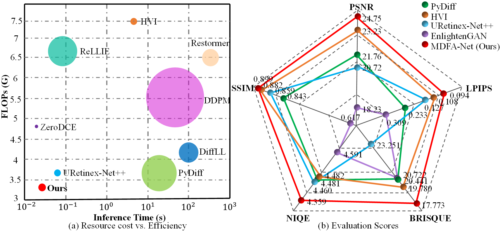

# DFA-Net: An efficient diffusion with frequency directional feature augmentation for low-light image enhancement
This is the code for **DFA-Net: An efficient diffusion with frequency directional feature augmentation for low-light image enhancement** by Wengai Li, Zhaolin Xiao and Haonan Su

## Pipeline


## Dependencies
```
pip install -r requirements.txt
````

## Datasets
The LOLv1 datasets can be downloaded from this [link](https://drive.google.com/file/d/1L-kqSQyrmMueBh_ziWoPFhfsAh50h20H/view). 
The LOLv2 datasets can be downloaded from this [link](https://drive.google.com/file/d/1Ou9EljYZW8o5dbDCf9R34FS8Pd8kEp2U/view).
Please refer to [[Project Page of RetinexNet.]](https://daooshee.github.io/BMVC2018website/)

## Pretrained Weights
The pretrained model, `DFA-Net.pth`, which can reproduce the quantitative results in the paper, is in the `weights` directory. We will organize and upload it as soon as possible.


## How to train?
You need to modify ```datasets/dataset.py``` slightly for your environment, and then
```
python train.py  
```

## How to test?
```
python evaluate.py
```
## Visual comparison

